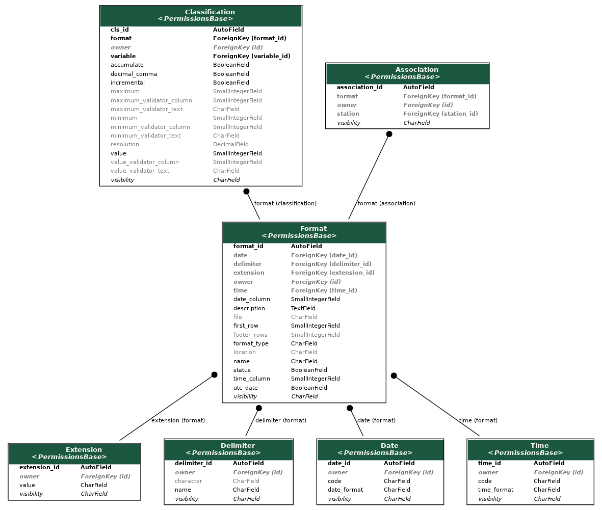

# Formatting

The formatting application describes how a data file should be ingested: what columns to consider, what variable they contain, the format of date and time, etc. A summary of the models involved can be seen in:

{: .caption}
