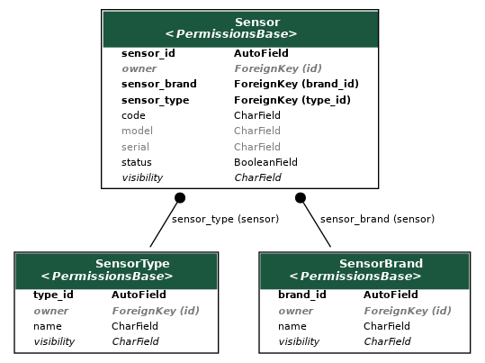

# Sensor

## Introduction

The sensor application is a small, straight forward application that contains metadata related to sensors, like brand or sensor type.

## Components

::: sensor.models.SensorType
    options:
      heading_level: 3
      show_bases: False
      members: None
      show_root_full_path: False

::: sensor.models.SensorBrand
    options:
      heading_level: 3
      show_bases: False
      members: None
      show_root_full_path: False

::: sensor.models.Sensor
    options:
      heading_level: 3
      show_bases: False
      members: None
      show_root_full_path: False
