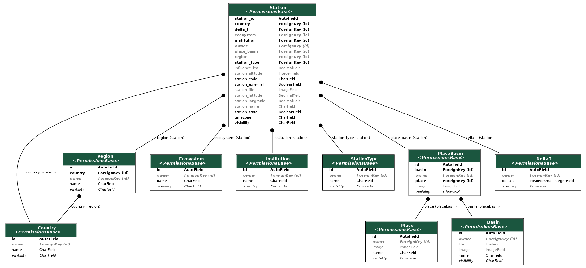

# Station

## Introduction

The Station is the main component of Paricia. Stations own the measurement data, who can view the existing data and add new sets, and captures a lot of metadata on the geographical location of the station, including longitude, latitude and altitude, but also region, basin, ecosystem or area covered.

It also owns two key parameters used during the data ingestion and the validation process: the **timezone** where the station is located, used to interpret the time of the datasets.

!!! warning "Incorrect `timezone`"

    If this parameter is not defined correctly, the time of the data associated to the station would be interpreted wrong or the validation process will flagged data as invalid, when it might be correct. **Check the parameter before uploading data, specially the first time.**

As pointed out in the [permissions page](../permissions.md), Stations visibility can take a third option, `internal`, that only allows registered users to visualize the data of the station. Stations also require `change` permission in order to be able to upload data associated to that station and then validating it.

## Basic Components

::: station.models.Country
    options:
      heading_level: 3
      show_bases: False
      members: None
      show_root_full_path: False

::: station.models.Region
    options:
      heading_level: 3
      show_bases: False
      members: None
      show_root_full_path: False

::: station.models.Ecosystem
    options:
      heading_level: 3
      show_bases: False
      members: None
      show_root_full_path: False

::: station.models.Institution
    options:
      heading_level: 3
      show_bases: False
      members: None
      show_root_full_path: False

::: station.models.StationType
    options:
      heading_level: 3
      show_bases: False
      members: None
      show_root_full_path: False

::: station.models.Place
    options:
      heading_level: 3
      show_bases: False
      members: None
      show_root_full_path: False

::: station.models.Basin
    options:
      heading_level: 3
      show_bases: False
      members: None
      show_root_full_path: False

::: station.models.PlaceBasin
    options:
      heading_level: 3
      show_bases: False
      members: None
      show_root_full_path: False

## Core Components

::: station.models.Station
    options:
      heading_level: 3
      show_bases: False
      members: None
      show_root_full_path: False
