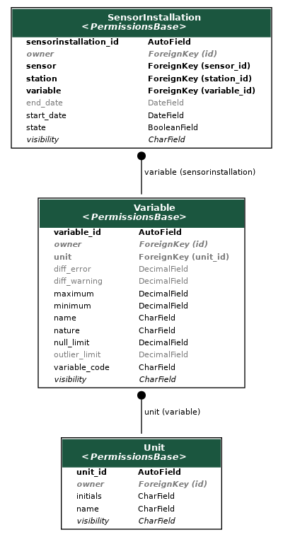

# Variable

## Introduction

The variable application deals with the variables that can be ingested by Paricia, from what they are and what units they use to resources to help in the validation process. Specially important in this validation process will be:

- the maximum and minimum values that the variable can realistically take (these are mandatory fields)
- the maximum variability between consecutive data points
- the maximum statistical difference with respect the series allowed for a data point before it is considered an outlier
- the fraction of missing values that are allowed when calculating reports

## Components

::: variable.models.Unit
    options:
      heading_level: 3
      show_bases: False
      members: None
      show_root_full_path: False

::: variable.models.Variable
    options:
      heading_level: 3
      show_bases: False
      members: None
      show_root_full_path: False

::: variable.models.SensorInstallation
    options:
      heading_level: 3
      show_bases: False
      members: None
      show_root_full_path: False
