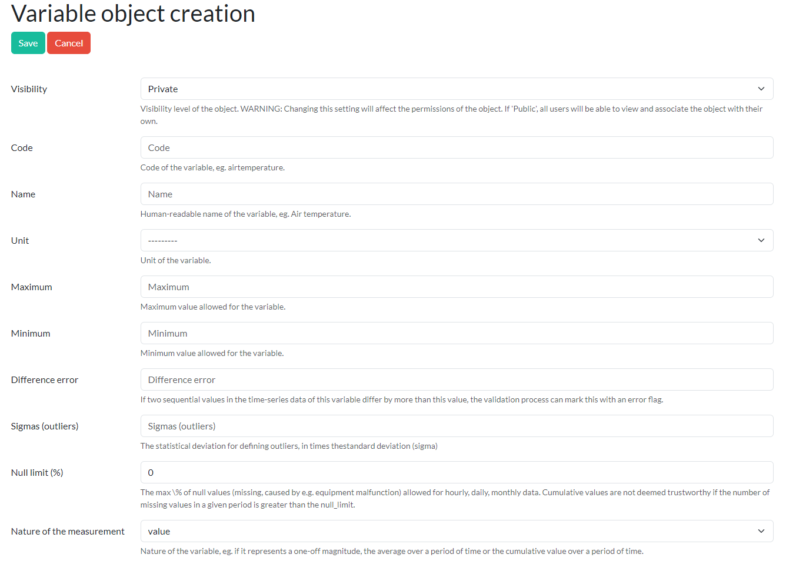

# Adding elements

Registered users can either use existing elements - formats, variables, etc. - as long as these are public (see the [Permissions](./permissions.md) section), but they can also create their own to suit their specific needs.

All elements that can be created in Paricia - except for the data import, which is discussed in [its own section](./importing_data.md) - follow a similar workflow:

- Choose the element of interest from the submenu in the top bar, e.g. `Variable` within the `Variables` menu.

- The page now displays the list of existing elements of that type that the user can view - i.e., those that are public or that are their own. You can sort the entries clicking on the column names or filter them to select just some entries.

- Clicking on an existing element ID allows to view the details of that element and to edit it, if the user has permission to do so.
- Clicking on the `New` button at the top allows to create a new element of that type.

A new form will open with the fields that need to be completed for that element.

Some elements are very simple and have just one or two fields to complete. Others are more complicated and link, in turn, to other elements. Not all fields are mandatory, in general. If a mandatory field is not filled, it will be flagged when trying to save the element.

Let's take the variables creation form as an example.

As we can see in this form, there is a field called `Visibility`. All elements have this field and it defines who else can see the details and use the element to define their own elements.

Other fields, like `Unit`, are foreign keys to other elements and, in this case, are just informative - metadata to better understand the variable.

Finally, some fields are used during the validation or import process. That is the case of the maximum, minimum or difference error, in this case, which helps Paricia to identify and flag suspicious entries.

When creating a new element, is important that the meaning and purpose of the fields are properly understood. They all should have a description underneath explaining what they are for, but if that information is not complete or clear, please report it following the instructions in the [Contributing guidelines](./contributing.md).
