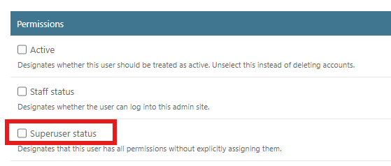

# Paricia administrator

Paricia administrators - or superusers - have full powers to control any aspect of Paricia, from giving permissions to other users to changing the visibility of objects. The exception to this is deleting objects that have dependants, as explained in the [permissions](./permissions.md) section.

There are two ways of becoming an Admin user

1. Asking another Admin to give superuser permissions to that user. This is done via the Paricia Admin. Within the `Users` app, select the user whose permissions need changing and check the box granting the user `Superuser status`, as shown in this picture:

2. Via the command line. This is a more advanced method and typically required only when setting up Paricia for the first time, either locally for development or in a new server. We will assume that that Paricia has been launched using `docker compose`, as instructed in the [installation instructions](./installation.md#docker-deployment). The steps in this case are:

    1. Open an terminal and access the server, if not for local development, via SSH or other method.
    2. Find the name of the container running the `paricia` image executing `docker ps`. It should be something like `paricia-web-1` or `paricia-app-1`.
    3. Create the superuser with `docker exec -it paricia-web-1 python manage.py createsuperuser`.
    4. You will be asked for a username, email and password. Complete all the details.

Once that is done, you should be able to login in to Paricia via the web interface and access the Paricia Admin.
