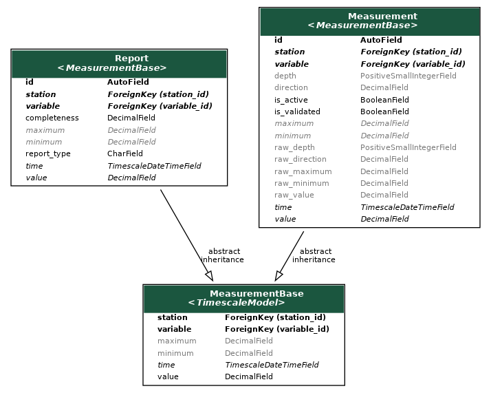

# Measurement

## Introduction

Any data ingested in or processed by Paricia takes de form of either `Measurement` or `Report` objects. Contrary to other elements of Paricia, **these are not meant to be created manually via de Admin pages**, but rather in the background when importing or when validating data.

!!! warning "Do not edit measurements in the Admin"

    **Directly editing measurements in the Admin pages is discouraged** since it can result in inconsistencies between raw, validated and reported data. Use the validation tools instead. See [the validation section](../validation.md)

In both cases, they represent a single data point in a time series, corresponding to a specific `Variable` at a specific `Station`. Only data corresponding to **public** stations will be available for checking in the case of anonymous users, whereas registered users could also check data from **internal** stations.

For the case of `Reports`, the data point is a post-processed magnitude averaged (or accumulated) over hourly, daily and monthly periods of time. Only data that has been validated is used when calculating the reports. `Report` data is what is used in the report view to generate plots, and can be downloaded. It is typically what most people will be interested in checking.

The `Measurement` represent an input data point loaded from a file, with all its properties and metadata. Most of its properties can be edited during the validation process, but the original raw data is always preserved and can be recovered when/if needed.

Both type objects derive from a `MeasurementBase` abstract class that contains the common elements, which in turns derives from `TimescaleModel`. This top parent class is the one that enables all the efficient time series management of the data in Paricia.

## Components

::: measurement.models.MeasurementBase
    options:
      heading_level: 3
      show_bases: True
      members: None
      show_root_full_path: False

::: measurement.models.Measurement
    options:
      heading_level: 3
      show_bases: False
      members: None
      show_root_full_path: False

::: measurement.models.Report
    options:
      heading_level: 3
      show_bases: False
      members: None
      show_root_full_path: False
