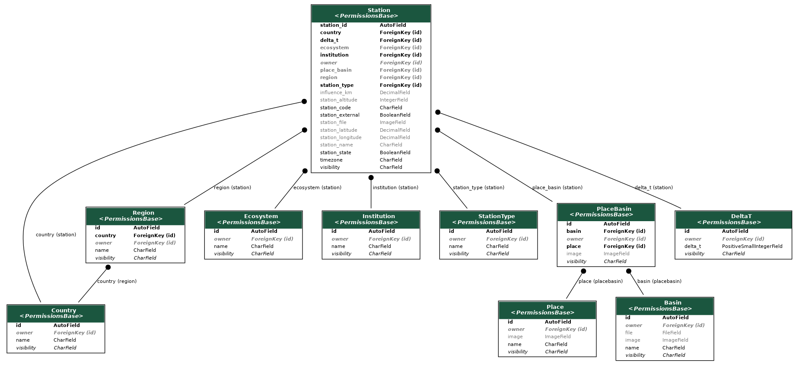

# Estación

## Introducción

La Estación es el componente principal de Paricia. La Estación es propietaria de los datos de medición, que le permiten visualizar los datos existentes y añadir nuevos conjuntos, y captura una gran cantidad de metadatos sobre la ubicación geográfica de la estación, incluyendo longitud, latitud y altitud, pero también región, cuenca, ecosistema o área cubierta.

También posee otro parámetro clave utilizado durante el proceso de ingesta de datos: la **zona horaria** donde se encuentra la estación, que se utiliza para interpretar la hora de los conjuntos de datos.

!!! advertencia "`Zona horaria` incorrecta"

Si este parámetro no se define correctamente, la hora de los datos asociados a la estación se interpretará de forma incorrecta. **Compruebe el parámetro antes de cargar los datos, especialmente la primera vez.**

Como se indica en la [página de permisos](../permissions.md), la visibilidad de las estaciones puede tomar una tercera opción, `interna`, que sólo permite a los usuarios registrados visualizar los datos de la estación. Las estaciones también requieren permiso de "cambio" para poder cargar datos asociados a esa estación y luego validarlos.

## Componentes básicos

::: station.models.Country
    options:
      heading_level: 3
      show_bases: False
      members: None
      show_root_full_path: False

::: station.models.Region
    options:
      heading_level: 3
      show_bases: False
      members: None
      show_root_full_path: False

::: station.models.Ecosystem
    options:
      heading_level: 3
      show_bases: False
      members: None
      show_root_full_path: False

::: station.models.Institution
    options:
      heading_level: 3
      show_bases: False
      members: None
      show_root_full_path: False

::: station.models.StationType
    options:
      heading_level: 3
      show_bases: False
      members: None
      show_root_full_path: False

::: station.models.Place
    options:
      heading_level: 3
      show_bases: False
      members: None
      show_root_full_path: False

::: station.models.Basin
    options:
      heading_level: 3
      show_bases: False
      members: None
      show_root_full_path: False

::: station.models.PlaceBasin
    options:
      heading_level: 3
      show_bases: False
      members: None
      show_root_full_path: False

## Componentes principales

::: station.models.Station
    options:
      heading_level: 3
      show_bases: False
      members: None
      show_root_full_path: False
