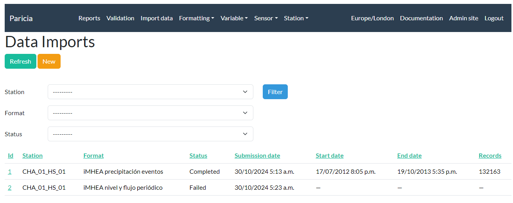
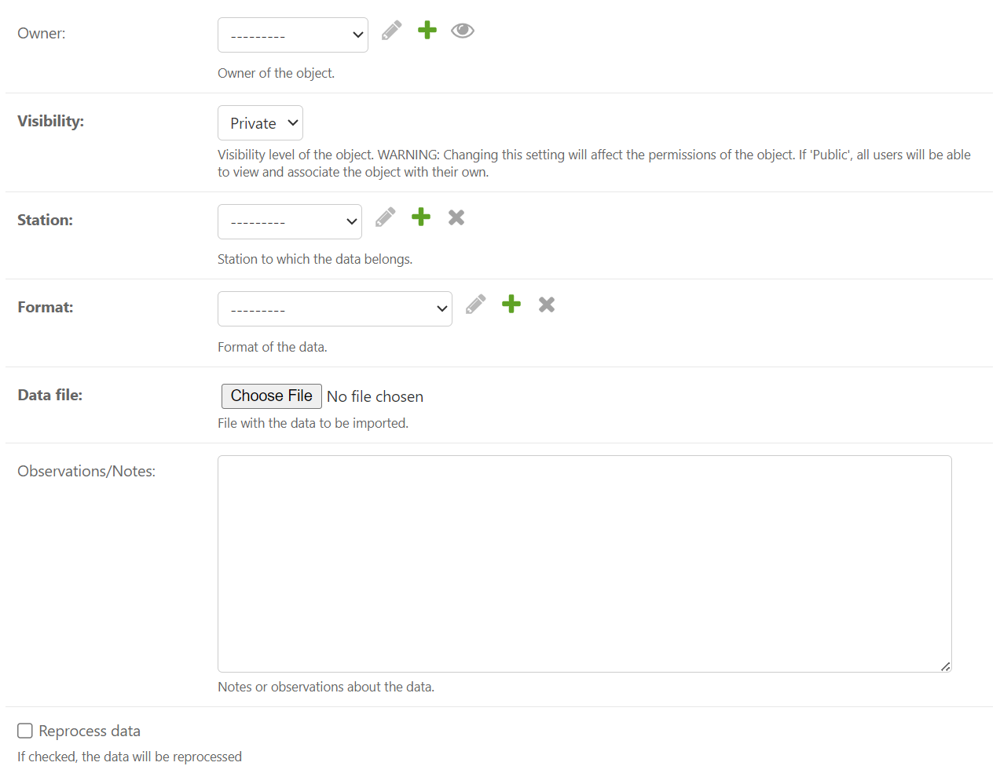
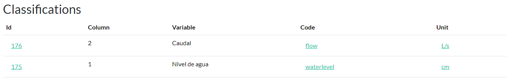
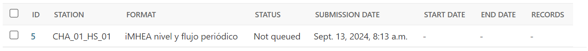
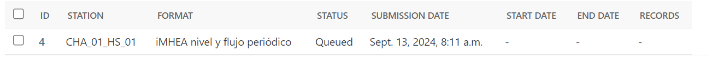
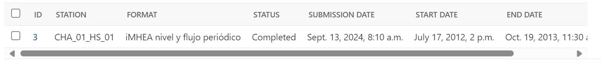
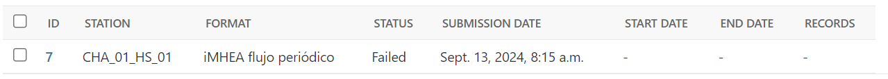

# Importing Data

## Submit the data import

Data import is done via Paricia import listing, clicking in the `New` button at the top of the page.

A form will open in a new page, containing several fields to be filled by the users.

### Format

The **Format** is the most important option to choose. If the format is not correct, the import process will fail - hopefully with a meaningful error message indicating what went wrong. If you are unsure about what format to choose, you can explore the options available from the menu `Formatting -> Format` and opening the formats you want to know more about.

**Within the specific format page**, among the different settings like the the date and time columns, separator, etc. you will find the **Classifications**, i.e. the list of variables and the columns they will be imported from if that format is used. **Column indexes start in 0**, so a variable imported from column number 2, for example, will be imported from the 3rd column of the file. Make sure this list of classifications match the information you want to import from the data file.

The following figure shows the classifications available for a particular format:

Clicking in each classification `id` will show you more information about that particular classification. Keep in mind you might not have permission to see the details of that classification.

### Station

For the Station, the user will only be able to choose those for which they have `change` permission. For the Format, the will be able to choose their own formats and those labelled as `public`.

The station needs to be complete, i.e. it needs to have all the required fields filled, something that might not be the case if the station was imported into Paricia. A usual field missing is the `timezone` if that were the case, you will be notified when trying to save the data import. To fix it, just go to the station page - `Station -> Station` in the top menu - and update the fields that are missing.

## Process the data

Once the form is complete, click `Save` at the top of the page and the import process will start. The data is ingested asyncronously, so the user can keep using Paricia. The status of the data import object indicate how the process is going:

- **Not Queued**: The data ingestion has not started, yet.

- **Queued**: The data ingestion has started. Data file has been opened and is being processed.

- **Completed**: The data ingestion has completed successfully. Information on the start and end dates of the data, as well as the number of records, will appear updated

- **Failed**: The data ingestion failed. Information on what went wrong should appear in the log box at the bottom of the data import detail. Try to fix the issues, based on the feedback provided, check the box `Reprocess Data`, and save the form again to trigger another data ingestion process.

Once the data has been ingested successfully, it will be available to validate in the [Validation screen](validation.md) and in the Report screen, if the Station it belongs to is labelled as public or internal.
