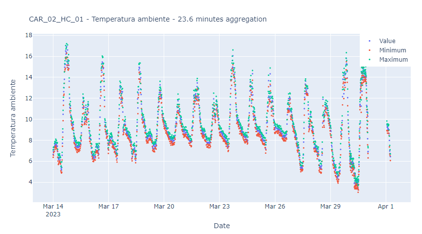

# Reporting

Paricia exposes the data it contains via the **Reports** page.

This page contains a form on the left hand side and a plot on the right, which will display the data selected in the form. No data is displayed in the plot when accessing the page.

## Report types

There are 5 types of reports that can be selected:

- Raw measurements: The original measurements, as submitted from the station.
- Validated measurements: The validated measurements after being checked by an operator, which might remove or change some of them of they were incorrect or suspicious.
- Hourly: Aggregating the validated data in hourly periods.
- Daily: Aggregating the hourly data in daily periods.
- Monthly: Aggregating the daily data in monthly periods.

All data will have a raw measurements report, but the others will be available only ifthe data has been validated.

## Stations, variables and date range

The user will only be able to select stations that they can view, meaning that users that are **not logged will see only stations that are public**. Register users will see **public and internal stations**, as well as their own, if any. Check the [Permissions](./permissions.md) for more details on the permissions of each user.

After selecting a station, the user will be presented with the variables available for that station, as well as the data range.

Once the chosen station, variable and date range is selected, then there are two options, downloading the data, which will download the record as a CSV file, or plotting the data.

## Report plot

The report plot implements progressive zooming, meaning that, in general, it will not display all the data in range - which could be millions of points - but just a fraction of it, to speed up the data transfer from the server.

The user can zoom in, selecting the region of interest, and finer data will be shown in that area. This can continue until the data shown is the complete dataset for that range. The title of the plot indicates the aggregation level, i.e. the average time difference between data points that is being displayed if not all data points are shown.

The following figure shows the ambient temperature in a period of a few weeks. The title indicates an aggregation level of around 23 minutes, meaning that data points displayed are separated 23 minutes on average. Mind that **no processing is done in the data** - no average or other manipulation - simply a selection of existing data points are plotted across the whole range. In other words, if the original data separation was 5 min, then an aggregation level of 23 min means that only 1 point in 4 or 5 is plotted.

In the next plot, we have zoomed in a little bit and now the average separation is 15 min.

In the final plot, the zoom is high enough such that no aggregation is required.

In all cases, to go back to the full range, either use the tools in the top right corner of the plot or double click on it.

## Missing spikes

The chosen approach for selecting the data to plot - just skipping points - is extremely fast as no data processing is required, but it has some drawbacks. In particular, as the display of the data skips a few points, the more points the highest the aggregation level, some features in the data might be lost.

For example, if we zoom in the first part of the series, we can see some - most likely wrong - data points shooting up to 50. These were not visible in the general view.

